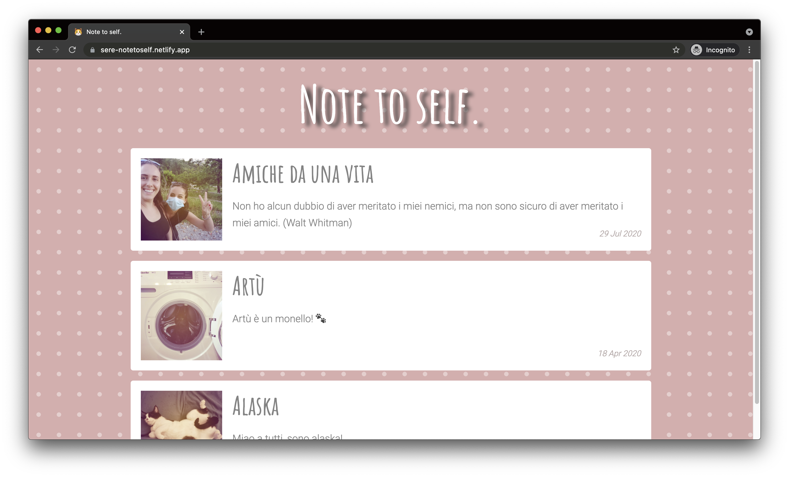

# Blog Sere Netlify CMS

This project is the basis of a personal private blog of a very dear friend of mine.

| \                | \                                                                                                                                                                    |
|------------------|----------------------------------------------------------------------------------------------------------------------------------------------------------------------|
| Pipeline         | [](https://app.netlify.com/sites/sere-notetoself/deploys) |
| Deploy preview   | https://sere-notetoself.netlify.app/                                                                                                                                 |
| Project typology | Personal                                                                                                                                                             |



## 🔥 Tech stack

| Purpose            | Technology   |
|:-------------------|:-------------|
| Templating         | Nunjucks     |
| Styling            | SCSS + BEMIT |
| Documentation      | Markdown     |
| CMS                | Netlify CMS  |
| Presentation layer | 11ty         |

## 🌊 Run development mode

```shell
# install dependencies
npm i

# serve with hot reload at localhost:8080
npm run dev
```

## 🧳 Build setup

```shell
# generate static project
npm run build
```

### 🌿 Branches

| Branch name | Use        |
|:------------|:-----------|
| `main`      | production |
